   pymatgen是Materials Project开发的一个python库,主要用于高通量计算的输入文件设置与输出文件处理，相关软件还有Fireworks，custodian，atomate，matminer，这些软件为高通量计算提供了一个完整的解决方案。pymatgen功能强大，针对Vasp的功能最为完善，利用pymatgen可以完成大部分Vasp计算的自动化处理，优势明显，大家可以自己去进一步学习，这里只为大家简单介绍一下pymatgen在能带结构与电子态密度画图方面的简单应用。

   官方文档：[http://pymatgen.org/](http://pymatgen.org/)

   github：[https://github.com/materialsproject/pymatgen](https://github.com/materialsproject/pymatgen)

   
   对于python小白，请直接看文末**python小白指南**。

   我们正式开始。我们计算的结构是ZrBrN,二维结构，POSCAR中只有三个原子。当前目录下有四个文件夹，so是优化计算，scf是自恰计算，bs是能带计算，dos是态密度计算，计算已经完成。注意：以！开头的是shell命令


```python
!ls
```

    bs	    plt_12.png	plt_16.png  plt_4.png  plt_8.png		   so
    dos	    plt_13.png	plt_1.png   plt_5.png  plt_9.png
    plt_10.png  plt_14.png	plt_2.png   plt_6.png  pymatgen_bs_dos_plot.ipynb
    plt_11.png  plt_15.png	plt_3.png   plt_7.png  scf


   pymatgen是面向对象编程，发挥了python的长处，因此我们首先需要创建要处理的对象。调用pymatgen.io.vasp.outputs模块，通过处理对应的vasprun.xml文件，得到两个对象dos_data与bs_data，包含了能带和态密度的所有信息。得到这两个对象以后，我们就可以根据自己的需求来画各种图，相应的模块是pymatgen.electronic_structure.plotter。


```python
import matplotlib.pyplot
from pymatgen.io.vasp.outputs import Vasprun
from pymatgen.electronic_structure.plotter import BSDOSPlotter,\
     BSPlotter,BSPlotterProjected,DosPlotter
dos_vasprun=Vasprun("./dos/vasprun.xml")
dos_data=dos_vasprun.complete_dos
bs_vasprun=Vasprun("./bs/vasprun.xml",parse_projected_eigen=True)
bs_data=bs_vasprun.get_band_structure(line_mode=1)
```

#  能带与态密度图
有时我们需要将能带与态密度放在一起作比较，BSDOSPlotter可以实现这一功能。

## 原始的能带与态密度图

将BSDOSPlotte的参数bs_projection与dos_projection的值均设置为None，表示不读取能带和态密度的投影信息，然后通过get_plot调用bs_data与dos_data画图。


```python
plt_1=BSDOSPlotter(bs_projection=None, dos_projection=None)
plt_1.get_plot(bs=bs_data,dos=dos_data)
matplotlib.pyplot.savefig('plt_1.png',img_format='png')
```


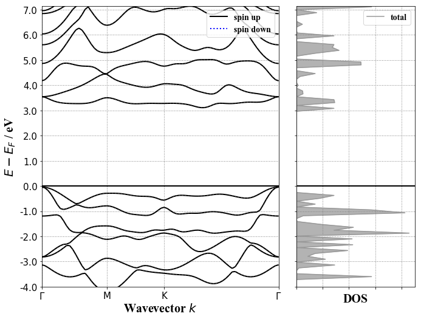


## 将能带与态密度投影到元素
将BSDOSPlotte参数bs_projection与dos_projection的值均设置为’elements‘，表示读取能带和态密度的投影到元素的信息。


```python
plt_2=BSDOSPlotter(bs_projection='elements', dos_projection='elements')
plt_2.get_plot(bs=bs_data,dos=dos_data)
matplotlib.pyplot.savefig('plt_2.png',img_format='png')
```


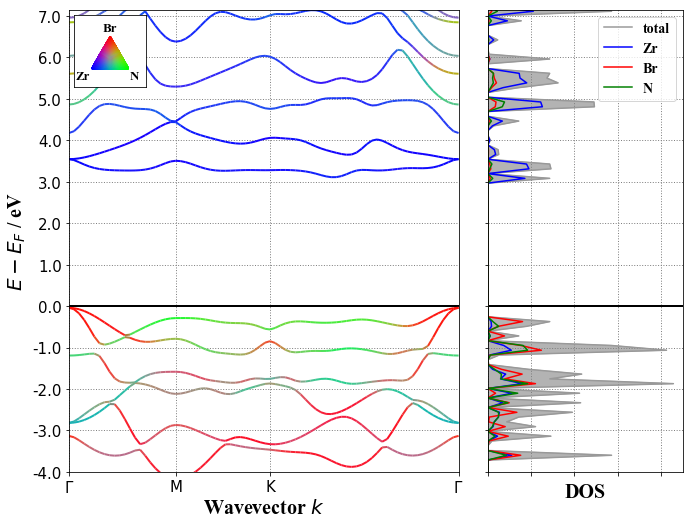


## 将能带投影到元素,态密度投影到轨道
将参数bs_projection设置为’element‘，dos_projection的值设置为‘orbitals’。


```python
plt_3=BSDOSPlotter(bs_projection='elements', dos_projection='orbitals')
plt_3.get_plot(bs=bs_data,dos=dos_data)
matplotlib.pyplot.savefig('plt_3.png',img_format='png')
```


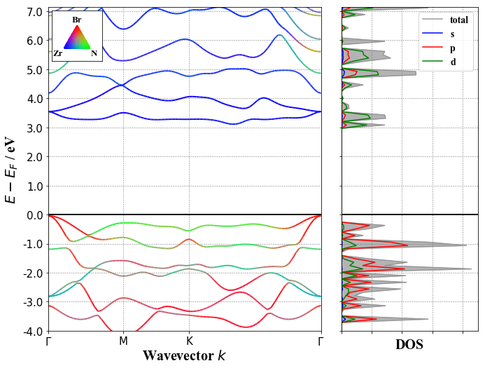


# 能带图
pymatgen中BSPlotter与BSPlotterProjected可以满足我们关于能带画图的绝大部分需求。

## 原始能带图
使用BSPlotter调用bs_data即可。


```python
plt_4=BSPlotter(bs=bs_data)
plt_4.get_plot()
plt_4.save_plot("plt_4.png",img_format='png')
```


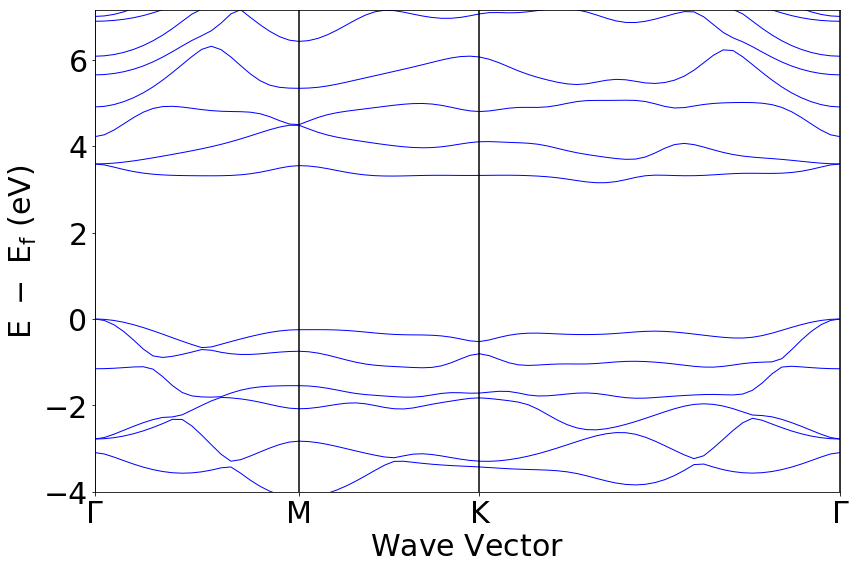


BSDOSPlotter也可以实现这一功能，我们需将BSDOSPlotter中的bs_projection与dos_projection设置为None，表示不读取投影信息，将get_plot的dos参数设置为None，表示不画态密度图。


```python
plt_5=BSDOSPlotter(bs_projection=None, dos_projection=None)
plt_5.get_plot(bs=bs_data,dos=None)
matplotlib.pyplot.savefig('plt_5.png',img_format='png')
```


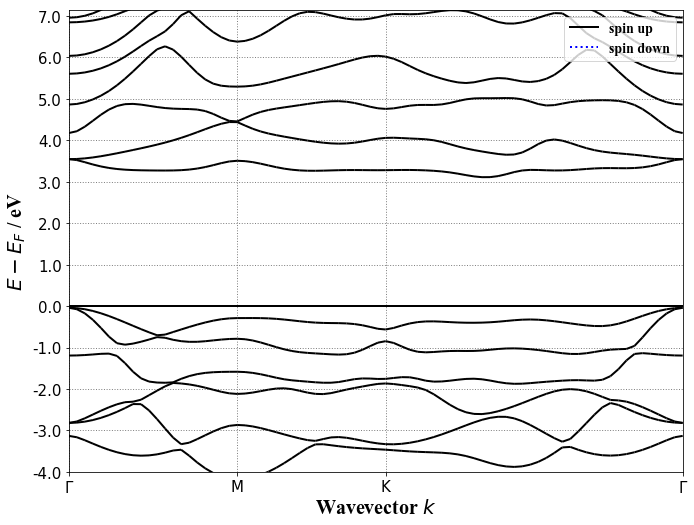


## 投影到元素的能带

BSPlotterProjected的get_elt_projected_plots可以将能带投影到每一种元素然后分别作图，通过线条的粗细来表示该元素对该轨道的贡献。


```python
plt_6=BSPlotterProjected(bs=bs_data)
fig_6=plt_6.get_elt_projected_plots()
matplotlib.pyplot.savefig('plt_6.png',img_format='png')
```


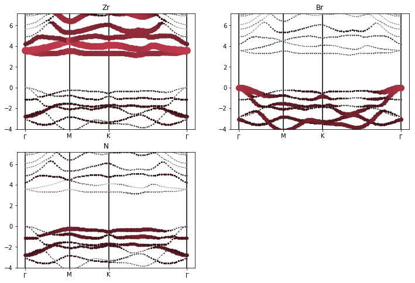


BSPlotterProjected的get_elt_projected_plots_color可以将能带投影到每一种元素作一张图，每一种元素对应一种颜色，通过不同的颜色来表示该元素对该轨道的贡献。


```python
plt_7=BSPlotterProjected(bs=bs_data)
fig_7=plt_7.get_elt_projected_plots_color()
matplotlib.pyplot.savefig('plt_7.png',img_format='png')
```


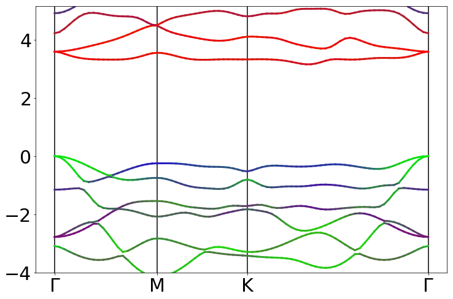


BSDOSPlotter也可以实现这一功能，我们只需将第一行的dos_projection与第二行的dos参数均设置为None即可。


```python
plt_8=BSDOSPlotter(bs_projection='elements', dos_projection=None)
plt_8.get_plot(bs=bs_data,dos=None)
matplotlib.pyplot.savefig('plt_8.png',img_format='png')
```


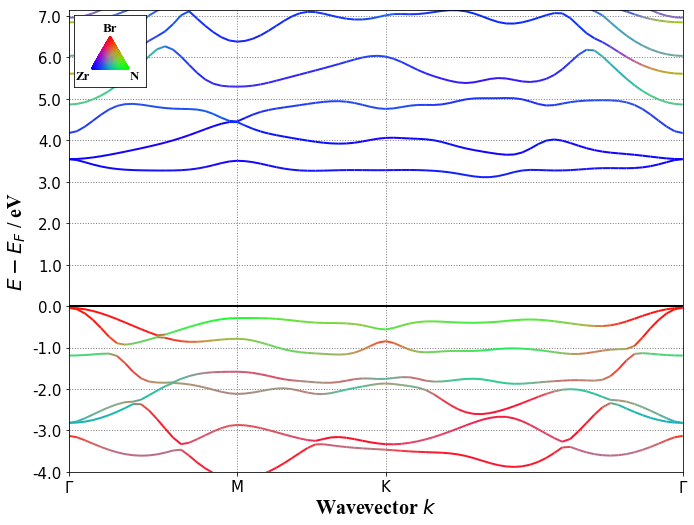


## 投影到轨道的能带

BSPlotterProjected中的get_projected_plots_dots可以将能带投影到不同元素的不同轨道，即角量子数，参数设置格式如下，大家将感兴趣的元素的轨道设置成如下格式即可，对于每一条轨道都将作图。


```python
plt_9=BSPlotterProjected(bs=bs_data)
plt_9.get_projected_plots_dots({'Zr':['d'],'Br':['p'],'N':['p']})
plt_9.save_plot('plt_9.png', img_format=u'png')
```


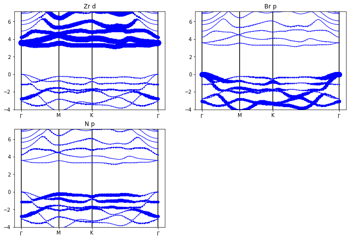


BSPlotterProjected中的get_projected_plots_dots_patom_pmorb的功能更加强大，可以将能带投影到不同原子的不同轨道，可以具体到磁量子数。dictio设置原子的磁量子数对应的轨道,dictpa表示原子信息，{'Br':[2]}代表在POSCAR中原子坐标在第二行的Br原子，由此我们可以看到，该方法支持将能带投影到结构中每一个原子的每一个轨道。


```python
plt_10=BSPlotterProjected(bs=bs_data)
plt_10.get_projected_plots_dots_patom_pmorb(dictio={'Br':['px','py','pz']}, \
                                            dictpa={'Br':[2]})
plt_10.save_plot('plt_10.png', img_format=u'png')
```

    You do not want to sum projection over orbitals.
    You do not want to sum projection over atoms.
    Number of subfigures: 3
    {'start_index': 0, 'end_index': 21, 'name': '\\Gamma-M'}
    {'start_index': 22, 'end_index': 41, 'name': 'M-K'}
    {'start_index': 42, 'end_index': 79, 'name': 'K-\\Gamma'}
    dictio_d: {'Br': ['px', 'py', 'pz']}
    dictpa_d: {'Br': ['2']}


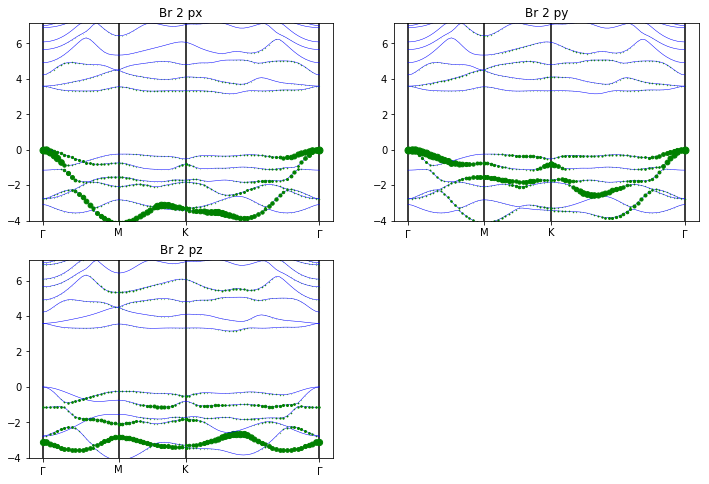


除此之外，get_projected_plots_dots_patom_pmorb还有两个重要的参数，sum_atoms可以画同种原子的总投影，sum_morbs可以画同种原子的不同轨道的总投影。下图展示了第一个原子Zr的d轨道投影与第二个原子Br的p轨道投影。这里的原子序号代表该原子在POSCAR中的位置。由于我的结构中每一种元素只有一个原子，所以无法展示sum_atoms相关功能，大家可自行查阅。


```python
plt_11=BSPlotterProjected(bs=bs_data)
plt_11.get_projected_plots_dots_patom_pmorb(dictio={'Zr':['d'],\
                                                    'Br':['px', 'py','pz']},\
                                            dictpa={'Zr':[1],'Br':[2]},\
                                            sum_morbs={'Br':['px','py','pz'],\
                                                       'Zr':['d']})
plt_11.save_plot('plt_11.png', img_format=u'png')
```

    You do not want to sum projection over atoms.
    Number of subfigures: 2
    {'start_index': 0, 'end_index': 21, 'name': '\\Gamma-M'}
    {'start_index': 22, 'end_index': 41, 'name': 'M-K'}
    {'start_index': 42, 'end_index': 79, 'name': 'K-\\Gamma'}
    dictio_d: {'Zr': ['d'], 'Br': ['p']}
    dictpa_d: {'Zr': ['1'], 'Br': ['2']}


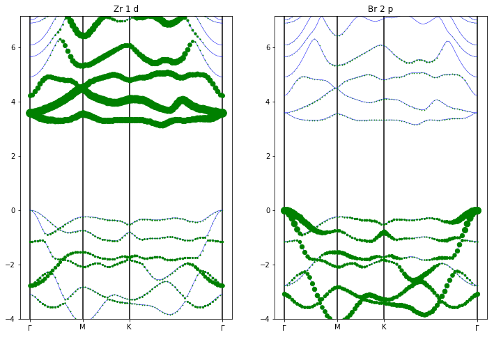


# 态密度图

   我们可以利用DosPlotter来画各种态密度图。DosPlotter有两个重要的参数，一是sigma，与INCAR中的SIGMA对应，我们可以通过调节sigma值的大小来调节态密度图的光滑程度。二是stack，可以决定作图方式是曲线还是面积，具体如下。
    
## 总态密度

DosPlotter中的add_dos用来定义要处理的对象dos,我们调用前边定义好的dos对象dos_data。我们取stack=False或False，sigma=0.5或初始值，来对比这两个参数的意义，结果如下。


```python
plt_12=DosPlotter(stack=False,sigma=0.5)
plt_12.add_dos('total dos',dos=dos_data)
plt_12.save_plot('plt_12.png', img_format=u'png')
```


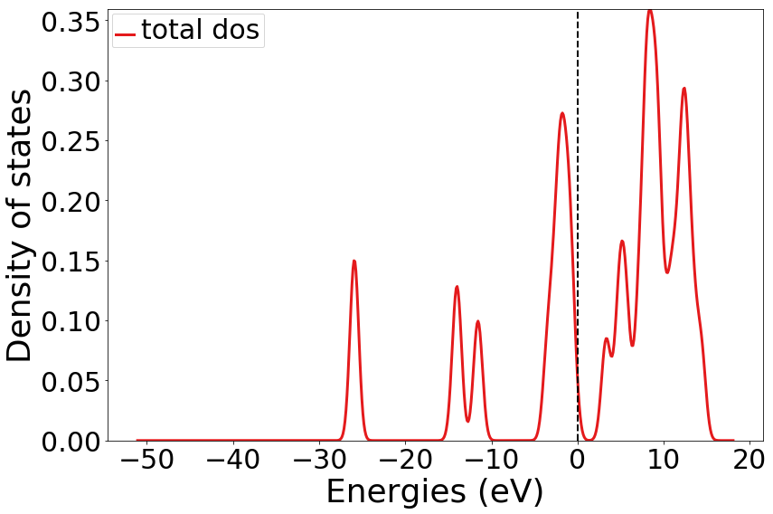


```python
plt_13=DosPlotter(stack=False)
plt_13.add_dos('total dos',dos=dos_data)
plt_13.save_plot('plt_13.png', img_format=u'png')
```


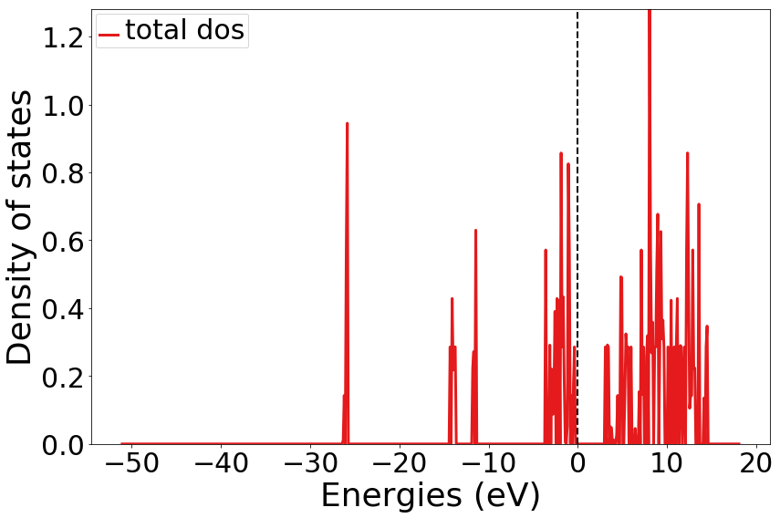


```python
plt_14=DosPlotter(stack=True,sigma=0.5)
plt_14.add_dos('total dos',dos=dos_data)
plt_14.save_plot('plt_14.png', img_format=u'png')
```


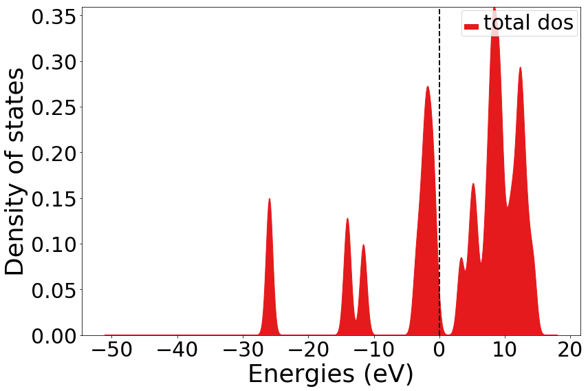


## 投影到轨道的态密度
利用add_dos_dict获取投影信息，对dos_data进行get_spd_dos操作，获得投影到轨道的信息。


```python
plt_15=DosPlotter(stack=False,sigma=0.5)
plt_15.add_dos('total dos',dos=dos_data)
plt_15.add_dos_dict(dos_data.get_spd_dos())
plt_15.save_plot('plt_15.png', img_format=u'png')
```


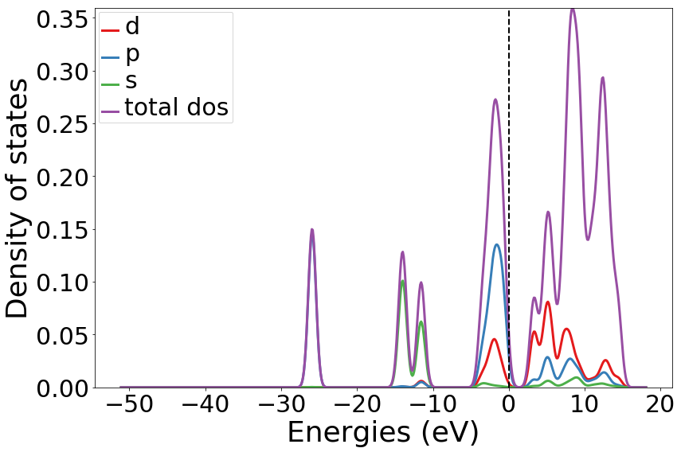


## 投影到元素的态密度

利用add_dos_dict获取投影信息，对dos_data进行get_element_dos操作，获得投影到元素的信息。


```python
plt_16=DosPlotter(stack=False,sigma=0.5)
plt_16.add_dos('total dos',dos=dos_data)
plt_16.add_dos_dict(dos_data.get_element_dos())
plt_16.save_plot('plt_16.png', img_format=u'png')
```


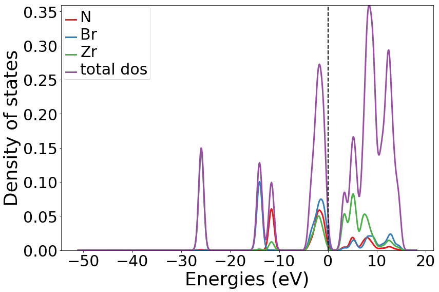


   以上就是全部内容，我在上边提到的各种方法还有许多参数，值得大家去仔细研究，大家也可以通过matplotlib设置图的字体和颜色等信息，定制各种高质量的能带与态密度图。pymatgen除了画图还在许多其他方面有强大的功能，有兴趣的可以自己去研究。接下来是针对python小白的简单粗暴的操作指南。
   

#  python小白指南

   首先，你的计算机应当已经安装好了pymatgen，才可以进行如下步骤。pymatgen支持pip安装。
   
   其次，确定你的计算文件的位置，将 In[2] 中vasprun.xml的路径做相应的更改。
   
   最后，按如下方法复制成python脚本，加号代表将两块代码复制在一个文件，并更改最后一行输出图片的名字和格式，运行脚本即可。
   
|要求|方法|
|:------ |:------ | 
| 原始的能带与态密度图 | In[2] + In[3] | 
| 将能带与态密度投影到元素 | In[2] + In[4] |
| 将能带投影到元素,态密度投影到轨道 | In[2] + In[5] |
| 原始能带图 | In[2] + In[6] 或 In[2] + In[7] | 
| 投影到元素的能带 | In[2] + In[8] 或 In[2] + In[9]或 In[2] + In[10]|
| 总态密度| In[2] + In[15]| 
| 投影到轨道的态密度 | In[2] + In[17]|
| 投影到元素的态密度 | In[2] + In[18] |

最后说两句：第一次写东西，经验不足，希望对大家有用，谢谢大家！
